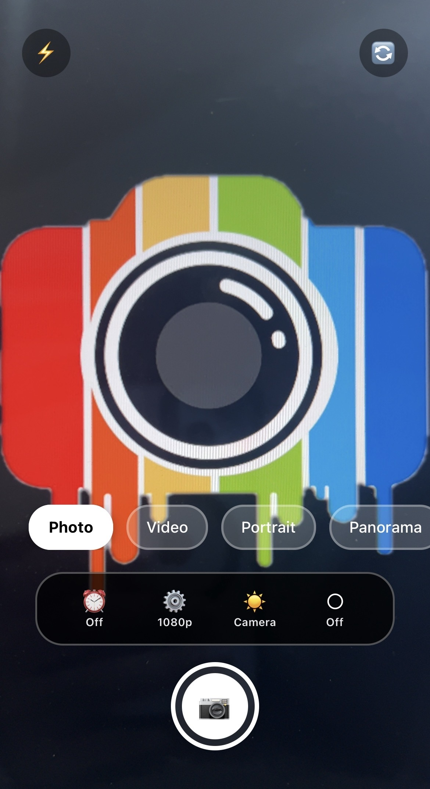

# 📸 Pro Camera (React / React Native)

<p align="center">
  
</p>


A **Pro Camera** interface built with modern React components, designed to mimic a professional camera experience.  
This project focuses purely on **camera service & functionality**, keeping the service logic consistent across platforms while allowing UI flexibility.

---

## ✨ Description

Pro Camera provides a modular, clean, and scalable camera system with professional-style controls such as:
- Live camera preview
- Capture actions (photo/video)
- Mode switching
- Quality & filter controls
- Clean top bar and control layout

The core **camera service remains the same**, ensuring consistent behavior, while UI components are separated for maintainability.

---

## 🧩 Key Features

- 📷 Live camera preview
- 🎥 Photo & video capture controls
- 🎚️ Mode selector (Photo / Video / Pro-style modes)
- 🎨 Filters & quality adjustments
- 🧭 Top bar with camera options
- 🧱 Modular component-based architecture

---

## 🗂️ Project Structure

```text
src/
├── App.tsx                 # Application entry point
├── ProCamera.tsx           # Main camera container
├── CameraPreview.tsx       # Live camera preview
├── CaptureButtons.tsx      # Photo/Video capture buttons
├── ModeSelector.tsx        # Camera mode selection
├── ControlContainer.tsx    # Wrapper for camera controls
├── Controls.tsx            # Aggregated controls
├── FilterControl.tsx       # Filter adjustments
├── QualityControl.tsx      # Resolution / quality settings
└── TopBar.tsx              # Top camera bar (flash, settings, etc.)
```

---

## ⚙️ How It Works

- **ProCamera.tsx** acts as the central orchestrator.
- Camera preview and controls are separated into independent components.
- Control components interact with the same camera service logic.
- Easy to extend with new controls (ISO, exposure, focus, zoom).

---

## 🚀 Getting Started

### 1️⃣ Install dependencies
```bash
npm install
```

### 2️⃣ Run the project
```bash
npm start
```
or
```bash
npm run dev
```

---

## 🛠️ Customization

You can:
- Add advanced camera controls (ISO, Shutter Speed)
- Integrate native camera APIs
- Extend filters & quality presets
- Connect with backend media storage

---

## 📌 Notes

- This README covers **only the camera service & functionality**
- Business logic and UI are intentionally decoupled
- Designed to be reusable across multiple projects

---

## 📄 License

This project is open-source and free to use for learning and development.
